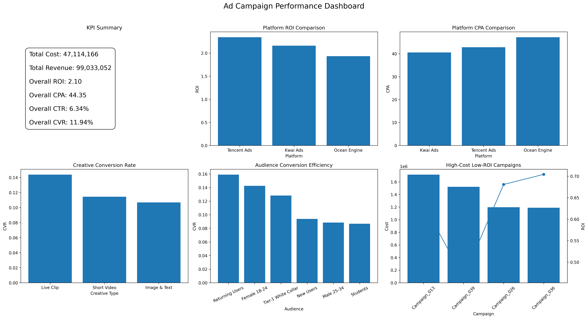
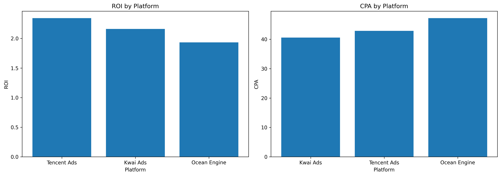
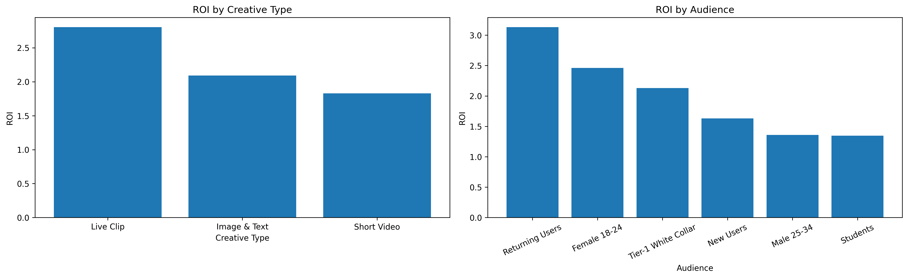
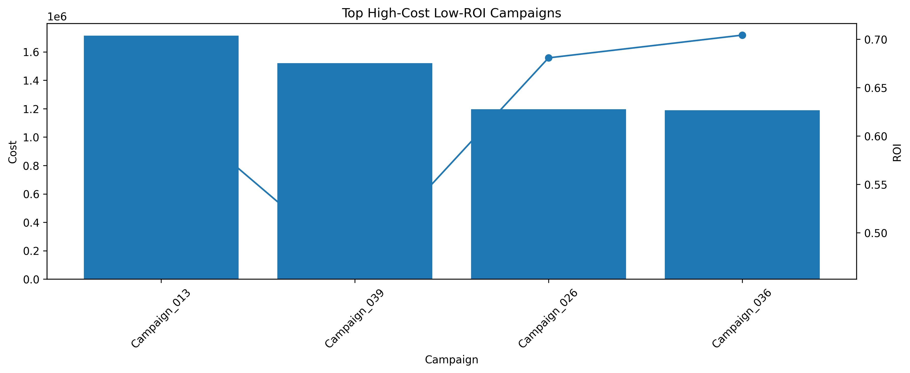

# 广告投放数据分析项目

## 一、项目简介
本项目基于仿真的广告投放业务数据，模拟广告分析实习场景，围绕平台、渠道、素材、人群和广告计划等维度，对投放效果进行多维分析，并进一步尝试使用机器学习模型预测 ROI，形成从数据生成、数据检查与清洗、指标构建、SQL 验证到问题计划识别与可视化输出的完整分析闭环。

本项目不基于真实公司业务数据，而是基于广告投放常见业务规则构造数据，重点在于演练广告分析中常见的方法、流程和思路。

---

## 二、项目目标
本项目主要希望回答以下问题：

1. 不同广告平台的投放效果是否存在明显差异？
2. 哪种素材类型更容易带来点击和转化？
3. 哪类目标人群具有更高的转化质量？
4. 哪些广告计划属于高消耗低 ROI 的低效计划？
5. 是否可以利用已有投放特征对 ROI 进行初步预测？
git
---

## 三、数据说明
项目数据为基于广告业务逻辑仿真生成的广告投放明细数据，共约 **20000 条记录**。

### 主要字段包括：
- `date`：投放日期
- `platform_en`：广告平台
- `channel_en`：投放渠道
- `campaign_name`：广告计划名称
- `ad_group`：广告组
- `creative_type_en`：素材类型
- `target_audience_en`：目标人群
- `plan_tier`：计划层级
- `impressions`：曝光量
- `clicks`：点击量
- `conversions`：转化量
- `cost`：广告消耗
- `revenue`：广告收入

### 衍生指标包括：
- `ctr`：点击率
- `cvr`：转化率
- `cpc`：单次点击成本
- `cpa`：单次转化成本
- `roi`：投资回报率

---

## 四、项目流程

### 1. 数据生成
项目首先基于广告投放业务规则构建仿真数据。  
通过设置不同广告计划层级（如高表现计划、稳定计划、低效计划等），为不同计划分配不同的基准 CTR、CVR、CPC、曝光量和转化价值，使数据在整体上更接近广告投放中的结构性差异。

### 2. 数据检查与清洗
使用 Python 与 Pandas 对数据进行检查与清洗，包括：
- 查看数据规模、字段结构和数据类型
- 检查缺失值与重复值
- 验证点击、转化、花费等指标逻辑是否合理
- 重新计算 CTR、CVR、CPC、CPA、ROI 等核心指标

### 3. 多维度效果分析
围绕广告投放常见分析维度展开：
- 平台效果分析
- 素材效果分析
- 人群效果分析
- 广告计划效果分析

### 4. SQL 聚合验证
将清洗后的数据写入 DuckDB，通过 SQL 对平台、素材、人群和计划层面的聚合结果进行验证，确保 Python 分析结果与 SQL 结果一致。

### 5. 问题计划识别
基于成本和 ROI 分位数规则，识别出高消耗低 ROI 的广告计划，用于模拟真实业务中的低效计划复盘场景。

### 6. ROI 预测模型
在完成基础描述分析后，进一步使用随机森林回归模型尝试预测 ROI，验证平台、渠道、素材、人群以及曝光、点击、转化、成本等特征对 ROI 的解释能力。

### 7. Dashboard 看板输出
将核心 KPI、平台效果、素材效果、人群效果以及低效计划清单整合为单页可视化看板，用于模拟业务复盘场景中的数据汇报页面。

---

## 五、核心分析内容

### 1. 平台效果分析
从平台维度统计曝光、点击、转化、消耗、收入，并计算 CTR、CVR、CPC、CPA、ROI 等核心指标，比较不同平台在流量质量与投放效率上的差异。

### 2. 素材效果分析
比较不同素材类型在点击率、转化率和 ROI 上的表现，识别更适合放量或更适合转化的素材形式。

### 3. 人群效果分析
从目标人群维度分析 CVR、CPA 和 ROI，观察不同人群在投放中的转化质量和成本表现。

### 4. 高消耗低 ROI 计划识别
基于量化规则筛选高消耗但回报较差的广告计划，用于模拟业务中优先治理低效计划的分析动作。

### 5. ROI 预测与特征重要性分析
基于平台、渠道、素材、人群、曝光、点击、转化和成本等特征，对 ROI 进行回归预测，并通过特征重要性分析识别哪些变量对 ROI 的影响更大。

---

## 六、项目主要结论

### 1. 平台之间存在明显效果差异
在当前模拟规则下，不同广告平台在 ROI 和 CPA 上存在差异，说明平台之间在流量质量、成本结构和转化效率上具有结构性不同。

### 2. 视频类素材整体转化表现更优
从素材维度看，Short Video 在当前场景下通常具有更好的转化表现，说明视频类素材在吸引用户和促进转化方面具有优势。

### 3. Returning Users 具有更高的转化质量
在人群分析和特征重要性分析中，Returning Users 的表现更突出，说明老客人群通常具有更高的转化效率和收益贡献。

### 4. 高消耗低 ROI 计划会拖累整体投放效率
项目识别出若干高消耗但 ROI 偏低的广告计划，这类计划虽然花费较高，但收益表现较差，应优先进行预算复盘、素材调整或人群优化。

### 5. ROI 主要受转化量和成本驱动
在机器学习模型的特征重要性结果中，`conversions` 和 `cost` 是影响 ROI 的核心变量；此外，目标人群和平台特征也对 ROI 具有一定解释能力。

---

## 七、模型分析说明
本项目中的建模部分基于仿真广告业务数据，其主要目的不是构建可直接部署上线的生产模型，而是：

- 验证已有投放特征对 ROI 的解释能力
- 完整演练从描述分析到预测分析的过程
- 为后续真实业务场景中的 ROI 预测或低效计划预警提供思路参考

从实际结果看，模型能够较好拟合 ROI 的整体变化趋势，尤其在中低 ROI 区间表现较为稳定；高 ROI 区间由于样本波动更大，预测误差相对更明显。

---
## 八、可视化看板展示

### 1. 广告投放总览看板



该总览看板用于快速展示广告投放的核心业务指标和主要分析结论，包括：

- **KPI Summary**：展示总消耗、总收入、整体 ROI、整体 CPA、整体 CTR、整体 CVR 等关键指标，用于快速评估整体投放表现。
- **Platform ROI Comparison**：对比不同广告平台的 ROI 表现，用于判断预算应优先向哪些平台倾斜。
- **Platform CPA Comparison**：对比不同平台的获客成本，识别成本较高的平台。
- **Creative Conversion Rate**：分析不同素材形式的转化率差异，评估素材效果。
- **Audience Conversion Efficiency**：分析不同目标人群的转化率差异，识别人群质量。
- **High-Cost Low-ROI Campaigns**：识别高消耗但低回报的广告计划，用于后续优化治理。

---

### 2. 平台效果分析



该图主要从平台维度分析广告投放效果，包括：

- **ROI by Platform**：比较不同平台的投入产出比，判断高回报平台。
- **CPA by Platform**：比较不同平台的单次转化成本，判断高成本平台。

通过平台效果分析，可以进一步支持预算分配优化，例如优先增加高 ROI、低 CPA 平台的投放预算，控制低效平台成本。

---

### 3. 素材与人群效果分析



该图从素材和人群两个维度分析广告投放表现：

- **ROI by Creative Type**：对比不同素材类型的 ROI，判断哪类素材更适合放量。
- **ROI by Audience**：对比不同目标人群的 ROI，识别高质量受众群体。

通过该分析可以支持素材优化和人群策略优化，例如优先使用高 ROI 素材形式，并对高转化质量人群加大预算投入。

---

### 4. 高消耗低回报广告计划识别



该图用于识别投放中的问题计划：

- **柱状图**表示广告计划的消耗成本（Cost）
- **折线图**表示广告计划的 ROI

通过同时观察成本和 ROI，可以快速定位“高消耗、低回报”的低效计划，并作为优先优化对象。  
这类计划通常需要重点排查以下问题：

- 素材疲劳或素材吸引力不足
- 目标人群匹配度较低
- 平台投放策略不合理
- 出价或预算设置不合理

---

## 业务结论与优化建议

基于以上可视化分析结果，可以从以下几个方向进行广告投放优化：

### 1. 平台预算优化
优先向高 ROI、低 CPA 的平台倾斜预算，降低低效平台预算占比，提高整体投放回报率。

### 2. 素材策略优化
优先使用转化效率和 ROI 更高的素材类型进行放量，同时定期更新低表现素材，减少素材疲劳带来的效果下降。

### 3. 人群策略优化
针对高 ROI、高转化率人群加大投放力度；对于低表现人群，应优化定向策略或控制预算投入。

### 4. 低效计划治理
对高消耗低 ROI 计划建立定期复盘机制，重点检查素材、受众、出价和投放平台设置，持续提升整体投放效率。


## 九、项目价值
本项目的价值不在于证明真实业务落地结果，而在于完整演练了广告投放分析中较为核心的一套方法流程，包括：

- 数据生成与结构设计
- 数据检查与清洗
- 指标体系构建
- 多维度投放效果分析
- SQL 聚合验证
- 高消耗低 ROI 计划识别
- ROI 预测模型尝试
- Dashboard 可视化输出


---

## 十、技术栈
- Python
- Pandas
- NumPy
- Matplotlib
- DuckDB
- Scikit-learn
- Jupyter Notebook

---

## 十一、项目结构
```text
ad_campaign_analysis/
├── data/
│   ├── raw/                      # 原始模拟数据
│   └── clean/                    # 清洗后数据与汇总结果
├── figures/
│   ├── dashboard_summary.png     # 广告投放总览看板
│   ├── platform_performance.png  # 平台效果分析
│   ├── creative_audience_analysis.png
│   ├── problem_campaigns.png
│   ├── platform_roi.png
│   ├── platform_cpa.png
│   ├── cvr_by_creative_type.png
│   ├── cvr_by_audience.png
│   ├── high_cost_low_roi_campaigns.png
│   ├── roi_prediction_scatter.png
│   └── roi_feature_importance.png
├── notebook/
│   └── ad_campaign_analysis.ipynb
├── sql/
│   └── analysis.sql
├── .gitattributes
├── .gitignore
├── README.md
└── requirements.txt
```

## 十一、后续优化方向
- 1.接入更真实的广告投放数据，进一步验证当前分析框架的可迁移性
- 2.将roi预测扩展为低效计划预警模块
- 3.将当前notebook可视化迁移到Power BI，构建交互式看板
- 4.增加投放异常监控逻辑，例如成本异常上涨，转化异常下降等规则

## 十二、项目总结
本项目以仿真广告数据为基础，，完整演练了广告投放分析的核心流程。
虽然不基于真实公司业务，但通过数据清洗、指标构建、多维分析、sql验证、模型预测与dashboard输出，较系统地展示我在广告分析方向的实践能力
